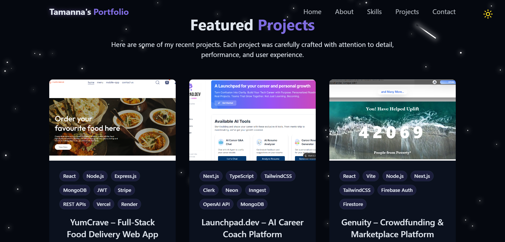

<h2 align="center">
  Personal Portfolio Website<br/>
  <a href="https://portfolio-git-main-tamanna-kapoors-projects-fbec9912.vercel.app" target="_blank">
    your-portfolio-link.vercel.app
  </a>
</h2>

<div align="center">
  
</div>

<br/>

<div align="center">


&nbsp;


</div>


---

## ✨ Overview

This repository contains my **personal portfolio website**, built to showcase my projects, skills, and learning journey as an aspiring software engineer.  
The goal of this project was to create a **clean, modern, and responsive portfolio** that reflects both my technical abilities and personal growth.

---

## 🧰 Tech Stack

The portfolio is built using:

- **React** (with Vite)
- **Tailwind CSS**
- **JavaScript (ES6+)**
- **Lucide React Icons**
- **Modern component-based UI**
- **VS Code**

---

## 🚀 Key Features

- ⚡ Fast and optimized build using Vite
- 🎨 Modern, minimal UI with smooth animations
- 🌗 Light & Dark mode support
- 📱 Fully responsive on all devices
- 🧩 Reusable and well-structured components
- 📂 Easy to customize content and sections

---

## 🛠 Setup & Installation

Make sure **Node.js** and **Git** are installed on your system.

### Clone the repository
```bash
git clone https://tamannaakapoor/Portfolio.git
cd Portfolio
